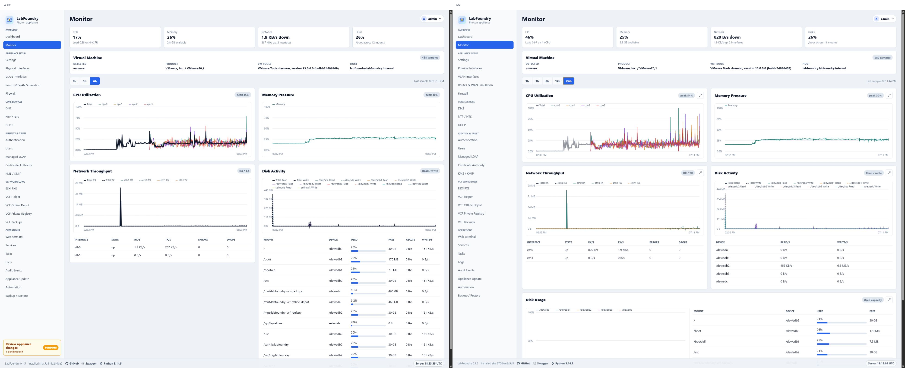
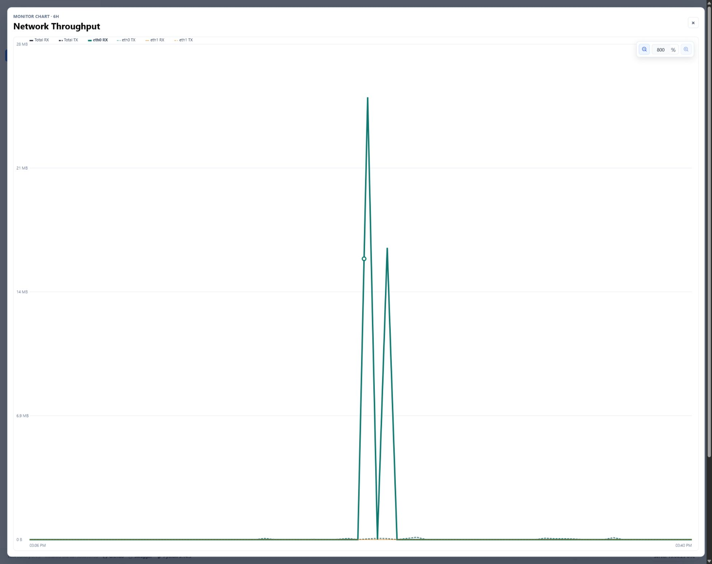
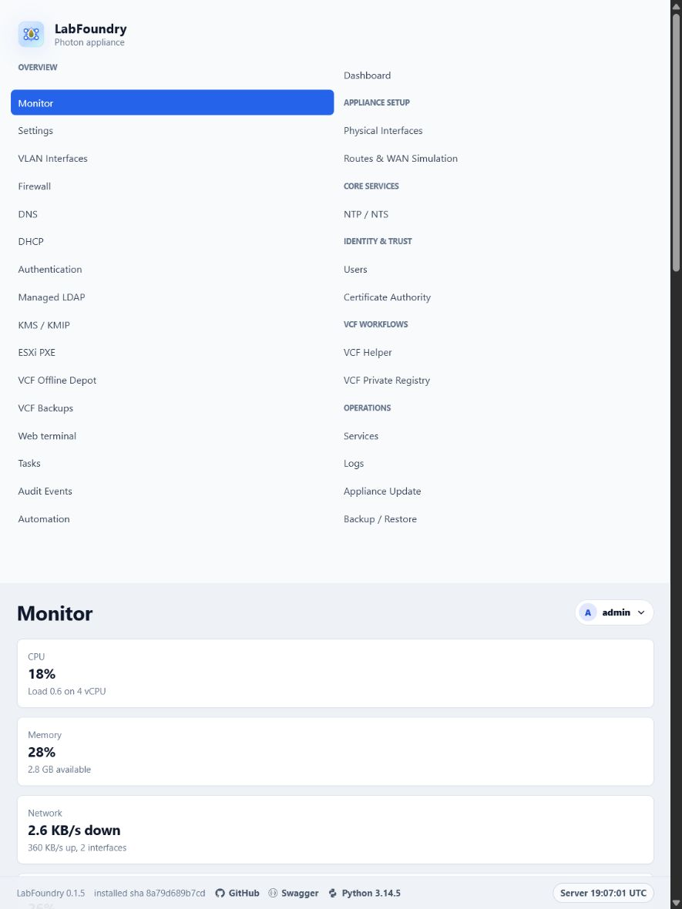

# Monitor hierarchy and interaction design QA

## Reference and capture setup

- Source: browser annotation captured from `https://192.168.167.219/monitor` before the hierarchy changes.
- Desktop viewport: 1968 × 1562 CSS pixels at the browser's native device density.
- Narrow viewport: 900 × 1200 CSS pixels.
- Live implementation: VMware appliance `192.168.167.219`, deployed with the repository VMware wheel helper.
- Final shared cache revision: `monitor-apply-ux-20260722-11` / `labfoundry-pwa-v149`.

## Comparison

The final desktop capture keeps the existing LabFoundry shell while making the metric hierarchy explicit: aggregate lines remain visible beneath thin detail lines, Disk Activity owns unique-device I/O, and Disk Usage owns capacity. Network Throughput and Disk Activity stretch to the same row height. The Disk Activity device table and Disk Usage mount table remain visible.

## Interaction evidence

- Full-screen-only zoom uses the in-chart lens controls and editable percentage.
- A tall spike was selected along its line segment, pinned after pointer movement, and cleared from empty chart space.
- Legend selection was exercised live: `Total` selected, a second click cleared it, and `cpu0` then became selected.
- 12h and 24h controls were exercised live; both became active and returned a successful Monitor refresh.

## Responsive check

At 900 × 1200 the dashboard returns to natural stacked sizing; full-width controls remain reachable and the desktop two-column card coupling does not force a fixed narrow height.

## Review history

1. Added total/detail hierarchy and unique-device disk series.
2. Split Disk Activity from Disk Usage and restored the per-device I/O table.
3. Added full-screen charts, in-chart percentage zoom, and drag-to-select zoom.
4. Expanded hit testing from sampled points to complete line segments.
5. Equalized Network Throughput and Disk Activity desktop card heights.
6. Added clickable legend selection plus 12h and 24h history ranges.

## Final result

The live implementation matches the requested Monitor organization and interactions at the supplied desktop viewport and preserves a usable narrow layout. No remaining visual mismatch was found in the scoped cards and full-screen chart flow.
